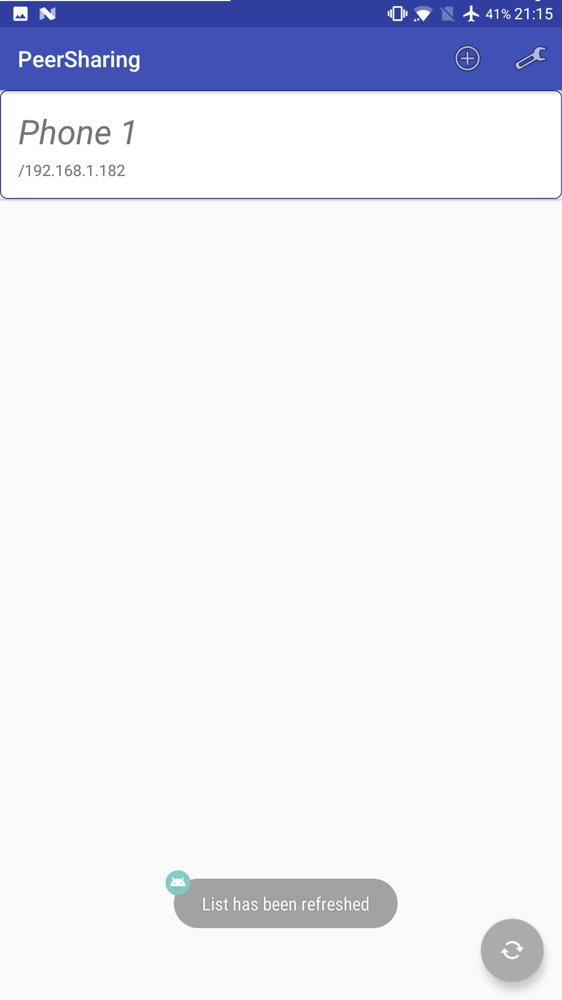
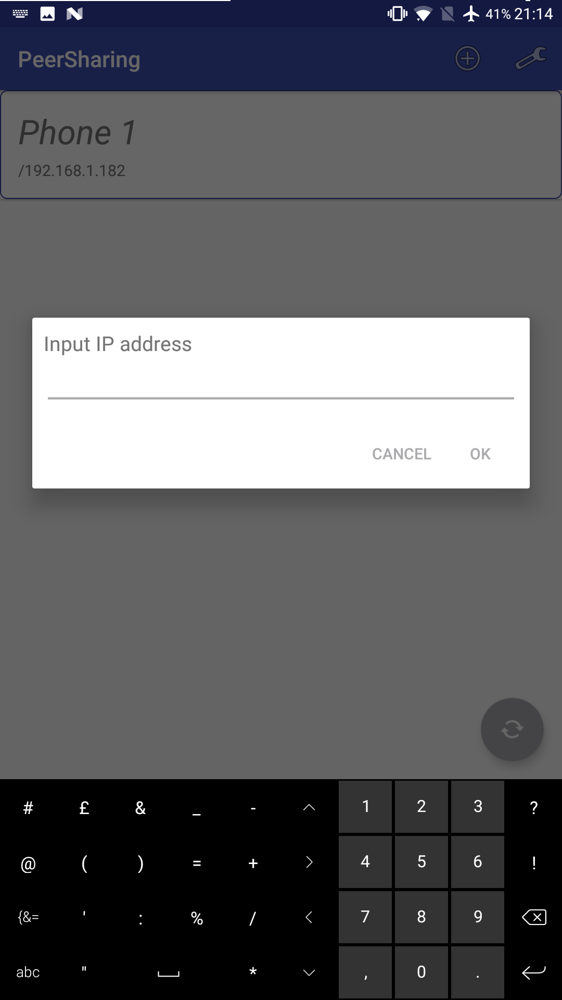
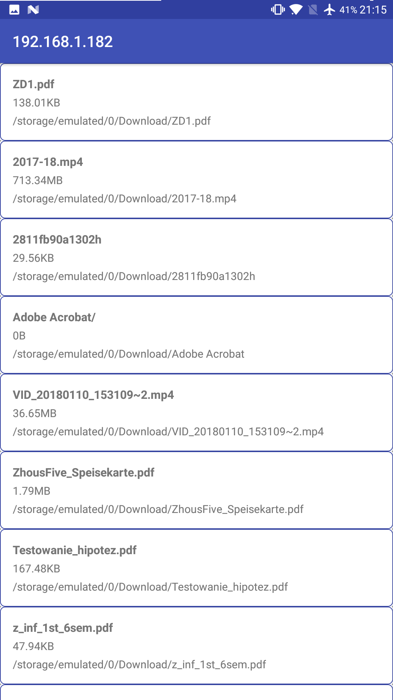
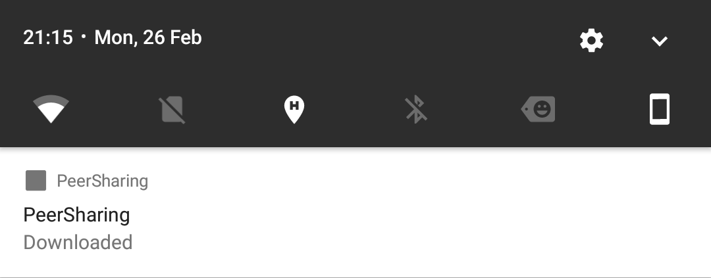

# Android application to share files - P2P protocol

## Used technologies:
 - Android
 - Java network sockets
 - Threads
## Features:
 - Finding phones in the same network (UDP broadcast)
 - Sending shared files (TCP)
 - Showing list of files (`RecyclerView`)
 - Downloading selected file (Service)
 - Showing the progress of download (`Notification.Builder`)
## Missing:
 - Auto opening downloaded file
 - Changing folder for shared files
## Screenshots

